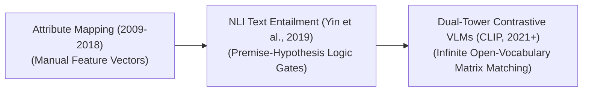

# Awesome-Zero-Shot-Classification
## Zero-Shot Classification: Evolution, Variants, Types, & Applications

Zero-Shot Classification (ZSC) is a specialized application of machine learning that allows a model to accurately categorize a given input (text, image, or audio) into a set of label classes it has never explicitly seen or been trained on. Traditional classification architectures freeze their output layers to map to a static number of classes (e.g., a fixed index of 10 customer service intents). ZSC reframes classification as a semantic alignment problem. By projecting both the input data and arbitrary natural language labels into a shared embedding or logical space, the model dynamically measures which label fits best, allowing developers to update, change, or expand classification taxonomies instantly at runtime without retraining the model.

---

## 1. The Chronological Evolution

The technical progression of zero-shot classification has transitioned from rigid attribute mapping over small image vectors to text-based entailment loops and massive unified multimodal foundation systems.

*   **The Attribute-Mapping Era (Lampert et al., 2009)**
    *   *Concept:* The structural baseline, primarily used in computer vision. Target categories were broken down into intermediate, human-defined attribute grids (e.g., `[has_fur: yes, can_fly: no]`). The model learned to detect these properties on known classes and matched them to identify a completely novel, unseen category at test time.
    *   *Limitation:* Highly rigid and unscalable, as human annotators had to manually build extensive property truth tables for every possible label variant.
*   **The Natural Language Inference (NLI) Revolution (Yin et al., 2019)**
    *   *Concept:* Brought robust zero-shot classification to natural language processing. Yin et al. proved that text classification can be reframed as a **Premise-Hypothesis Entailment** task using pre-trained NLI models (like RoBERTa). The input text acts as the premise, and each candidate label is converted into a hypothesis sentence (e.g., `"This text is about {label}"`). The model scores whether the premise entails, contradicts, or remains neutral to each hypothesis.
    *   *Significance:* Fully democratized text classification, allowing developers to create highly accurate sentiment or topic classifiers on-the-fly using single words.
*   **The Contrastive Multi-Modal Foundation Era (~2021–Present)**
    *   *Concept:* Popularized by web-scale architectures like OpenAI's **CLIP** and Google's **SigLIP**. By aligning vision and language encoders over billions of image-text pairs, zero-shot classification became a native architectural baseline. To classify an unknown image, the system projects the pixel frame alongside text strings (e.g., `"a photo of a {label}"`) into a shared matrix, using cosine similarity to select the absolute highest dot-product match.

---

## 2. Core Technical & Architectural Variants

Depending on the underlying model family and data modality, Zero-Shot Classification is executed via distinct mathematical and algorithmic frameworks.

*   **NLI-Based Zero-Shot Classifiers (Text-Only)**
    *   *Mechanism:* Evaluates the probability of logical entailment over a pair of sentences. The classification scores are generated by normalizing the entailment logits across all candidate classes using a Softmax layer.
    *   *Examples:* `BART-Large-MNLI`, `DeBERTa-v3-Large-XNLI`.
*   **Dual-Tower Embedding Classifiers (Multimodal/Vision)**
    *   *Mechanism:* Utilizes separate specialized encoders to construct dense, normalized vector coordinates for the input object and the text labels independently. The similarity score is computed instantly as a localized vector dot product.
    *   *Examples:* CLIP, OpenCLIP, and SigLIP architectures.
*   **Generative / Prompt-Based Zero-Shot Classification (LLM In-Context)**
    *   *Mechanism:* Deployed within conversational foundation systems. Instead of reading logit arrays, the prompt forces the model to choose from an explicit options menu (e.g., `"Classify the text below into one of these options: [Finance, Tech, Health]. Return only the chosen option name"`), reading the terminal generated token.

---

## 3. Generalized vs. Conventional ZSC Testing Paradigms

When deploying a zero-shot classification matrix into live production environments, the systemic configuration of the evaluation space alters model accuracy.

*   **Conventional Zero-Shot Classification**
    *   *Setting:* The inference environment assumes a tightly controlled, closed workspace where the incoming data points are mathematically guaranteed to belong *exclusively* to the newly introduced, unseen label classes.
*   **Generalized Zero-Shot Classification (GZSC)**
    *   *Setting:* The industry production baseline. At test time, the model must simultaneously parse and evaluate data across a mixed pool containing both the original seen training classes and entirely new, unannotated unseen classes.
    *   *The Hurdle:* Suffered heavily from **Projection Bias**, where the network displays an aggressive mathematical tendency to misclassify novel elements into seen training categories because those historical vectors possess heavily dominant parameter terrain.

---

## 4. Production Engineering Challenges & Mitigations

While Zero-Shot Classification saves thousands of dollars in dataset labeling costs, scaling it to high-throughput commercial pipelines introduces unique optimization trade-offs.

*   **The Prompt Sensitivity Bottleneck (Prompt Engineering Tax)**
    *   *The Problem:* The classification accuracy of a zero-shot model is highly volatile and dependent on how the label is contextualized. For instance, in visual classification, a raw label like `"dog"` can fail, whereas embedding it inside a structural template like `"a crisp rendering of a small {label} in a park"` significantly improves precision.
    *   *Mitigation:* Implementing **Ensemble Prompt Averaging**. The input label is automatically distributed across 50 to 80 separate structural text templates simultaneously (e.g., CLIP's ImageNet prompt stack), and the final classification is determined by averaging the combined embedding vectors.
*   **High Inference Latency and Softmax Saturation**
    *   *The Problem:* If a user passes a massive taxonomy of candidate classes (e.g., trying to categorize a product into 5,000 distinct retail sub-buckets), the model must calculate independent forward passes or massive cross-attention matrices for *every single label*, causing a severe computational bottleneck.
    *   *Mitigation:* Deploying a **Hierarchical Taxonomy Router**. The classification task is broken down into a multi-tier tree: a fast, lightweight zero-shot step filters data into coarse macro-categories first (e.g., `Electronics`), which then dynamically routes the token payload to a highly localized leaf-node evaluation matrix.

---

## 5. Frontier Real-World Applications

*   **Dynamic E-Commerce Cataloging & Content Moderation**
    *   *Application:* Processes millions of uncurated user listings daily. When a marketplace adds an entirely new line of customized seasonal goods, zero-shot perception engines automatically index, tag, and screen incoming images and product descriptions for safety violations via natural language text commands, skipping annotation delays.
*   **Enterprise Document Sorting & Customer Intent Routing**
    *   *Application:* Powers high-volume automated corporate ticketing hubs. Inbound emails or support queries are scanned via NLI-based zero-shot pipelines to instantly classify customer intent (e.g., `Billing Issue`, `Account Cancellation Request`), forwarding the ticket to specialized departments with zero manual intervention.
*   **Zero-Shot Defect & Anomaly Screening in Manufacturing**
    *   *Application:* Computer vision arrays monitors assembly lines. Because collecting samples of ultra-rare hardware defects is practically impossible, zero-shot visual grounding engines are prompt-instructed to actively watch for raw descriptions of structural failure states (such as `"hairline surface fracture"` or `"misaligned rivet joint"`), alerting engineers instantly.

