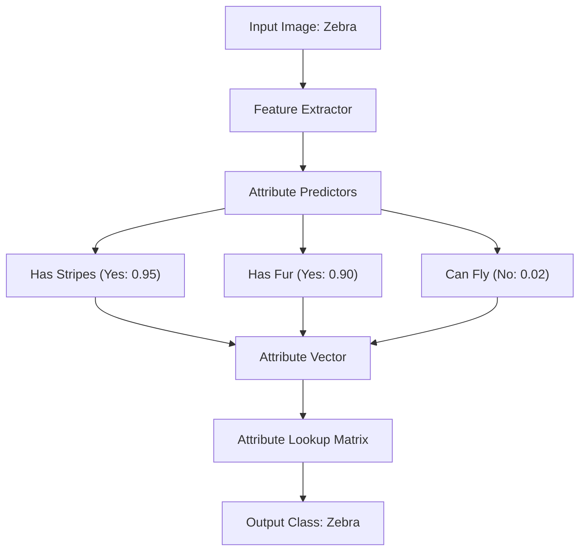

# Attribute-Mapping Era

The **Attribute-Mapping Era** (popularized around 2009 by Lampert et al.) represents the foundational stage of Zero-Shot Learning (ZSL), particularly in computer vision.

## Overview
Traditional image classifiers require training examples for every single target class. The Attribute-Mapping Era introduced an intermediate semantic layer composed of human-defined attributes (e.g., `has_stripes`, `has_fur`, `can_fly`). Instead of predicting the class directly from the image, the model is trained to predict these intermediate attributes. At inference time, the predicted attributes are compared to a predefined attribute matrix of unseen classes to determine the closest match.

## Key Mechanisms
1. **Direct Attribute Prediction (DAP):** The model learns a classifier for each attribute. Unseen classes are recognized by combining the attribute predictions using a probabilistic formulation.
2. **Indirect Attribute Prediction (IAP):** The model first predicts the seen classes, and then maps those class probabilities to attribute space.

## Limitations
- **Annotation Overhead:** Human experts must manually construct attribute matrices for all categories.
- **Semantic Bottleneck:** The representation is limited by the set of predefined attributes, which may not capture subtle visual differences.

[← Back to README](../README.md)
