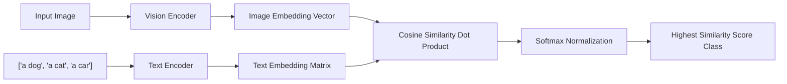

# The Contrastive Multi-Modal Foundation Era

The **Contrastive Multi-Modal Foundation Era** (starting around 2021 with architectures like CLIP and SigLIP) scaled zero-shot classification to open-vocabulary visual and multimodal environments.

## Overview
Instead of learning to categorize images into fixed indices, these models learn to align visual concepts with natural language descriptions in a shared embedding space. Pre-trained on billions of image-text pairs from the web, they can classify completely novel images by measuring their alignment with text prompts representing each candidate class.

## Key Mechanisms
1. **Dual Encoders:** One encoder processes the raw pixels (e.g., Vision Transformer or ResNet), and a separate encoder processes the text labels (e.g., Transformer).
2. **Contrastive Loss (InfoNCE):** The model is trained to maximize the cosine similarity of matching image-text pairs while minimizing the similarity of mismatched pairs.
3. **Open Vocabulary:** The classification catalog can be changed dynamically by constructing new text prompts without retraining the encoders.

[← Back to README](../README.md)
