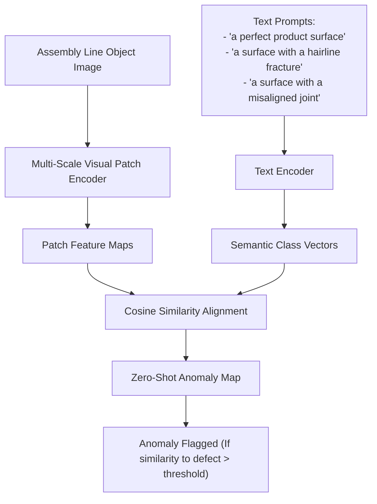

# Zero-Shot Defect & Anomaly Screening in Manufacturing

**Zero-Shot Defect and Anomaly Screening** is a cutting-edge visual application of zero-shot classification (e.g., using frameworks like WinCLIP) for industrial quality control.

## Overview
In manufacturing lines, gathering anomalous data is notoriously difficult because defects (like hairline fractures, misaligned rivets, or paint chips) occur rarely and are highly diverse. Standard supervised models fail because they cannot anticipate every possible defect signature. Zero-shot visual models solve this by comparing image patches to textual descriptions of normal and defective states.

## Key Frameworks: WinCLIP (CVPR 2023)
WinCLIP adapts CLIP for zero-shot anomaly detection by:
1. **Window-Based Multi-Scale Extraction:** Evaluating the image using overlapping windows/patches to localize spatial defects.
2. **Compositional Prompt Ensembling:** Creating a robust textual matrix describing normal states (e.g., `"flawless metal surface"`) and specific anomalies (e.g., `"scratched metal surface"`, `"dented metal surface"`).

[← Back to README](../README.md)
