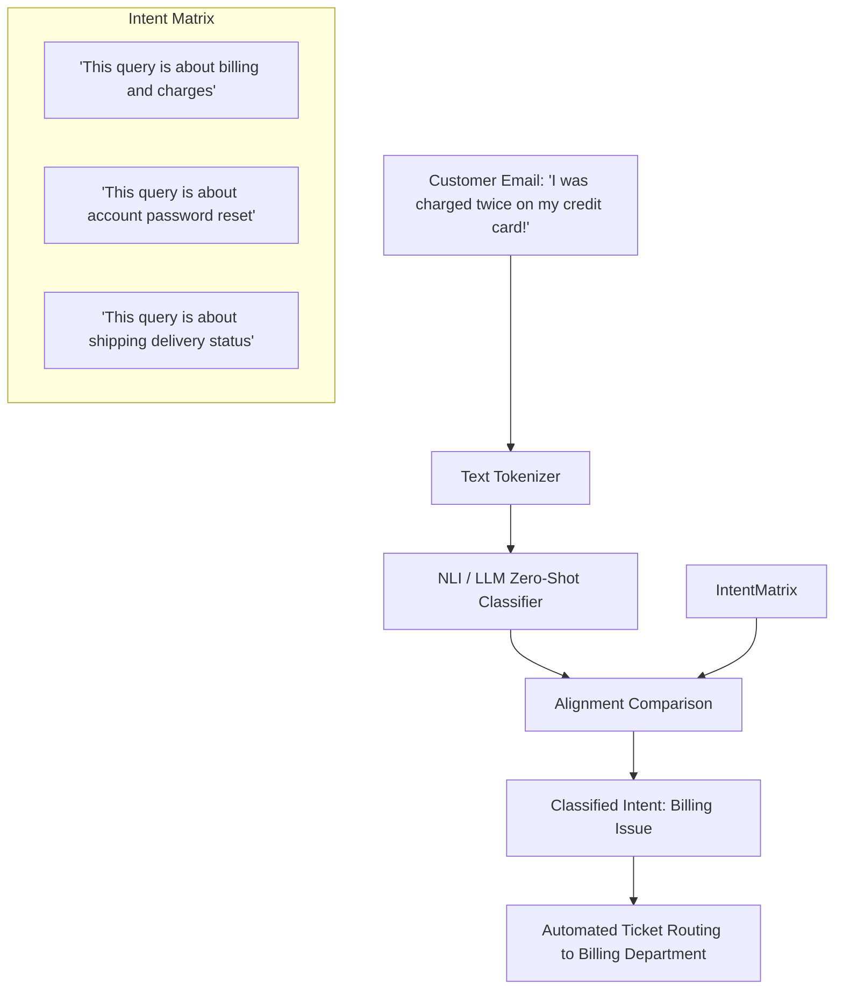

# Enterprise Document Sorting & Customer Intent Routing

**Enterprise Document Sorting and Customer Intent Routing** implements text-based zero-shot classification to automate customer support pipelines.

## Overview
Inbound corporate email channels and ticketing systems receive massive volumes of unstructured text requests. Utilizing pre-trained NLI models or instruction-tuned LLMs, enterprises can classify these incoming requests into dynamic taxomony categories (e.g., `Refund Request`, `Technical Support`, `Sales Query`) without waiting to gather thousands of labeled training tickets.

## Key Advantages
- **Day-1 Usability:** Systems can be deployed instantly on new product lines or campaigns before any customer interaction history is recorded.
- **Easy Policy Updates:** Changing the routing logic is as simple as adding a new label option (e.g., `"Query about the new summer promotional coupon"`) to the list.

[← Back to README](../README.md)
