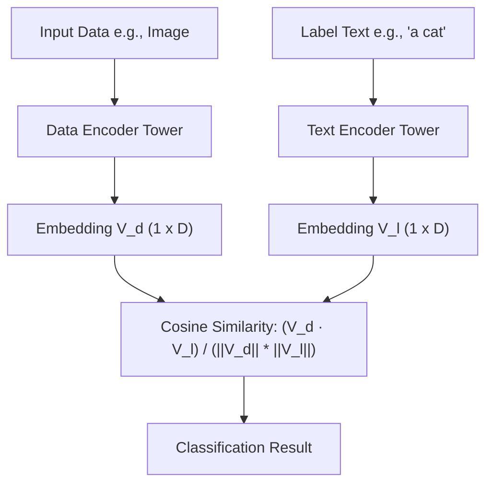

# Dual-Tower Embedding Classifiers

**Dual-Tower Embedding Classifiers** (introduced in pioneering works like DeVISE in 2013 and popularized by modern vision-language models like CLIP and SigLIP) are architectures that split the encoding of target data and text labels into two independent parameter pipelines.

## Architecture
The "dual-tower" name comes from the two distinct neural network towers that run in parallel:
- **Tower A (Data Encoder):** Projects the input data (e.g., image, audio, or document) into a dense $D$-dimensional vector space.
- **Tower B (Text Encoder):** Projects candidate label texts or natural language descriptions into the exact same $D$-dimensional vector space.

Zero-shot classification is then performed by finding the label vector that has the maximum cosine similarity (minimum distance) with the data vector.

## Key Advantages
- **Inference Efficiency:** The embeddings for a large set of candidate labels can be computed once and cached. For each incoming image/data point, the model only needs to run the Data Encoder and a fast matrix dot-product search, bypassing expensive joint attention modules.
- **Modularity:** The encoders can be updated, scaled, or replaced independently as long as they map to the same joint embedding dimension.

[← Back to README](../README.md)
