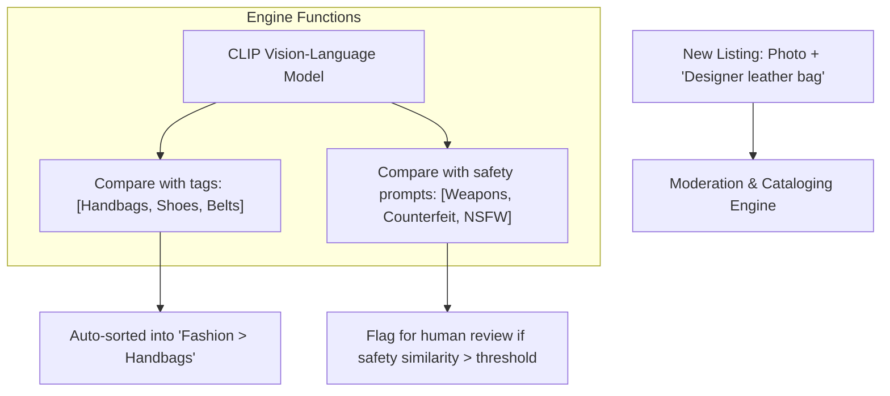

# Dynamic E-Commerce Cataloging & Content Moderation

**Dynamic E-Commerce Cataloging and Content Moderation** is a widespread commercial application of zero-shot classification, enabling platforms to scale listings securely.

## Overview
Marketplaces receive millions of user listings every day, spanning a massive and shifting variety of products. Fine-tuning supervised models for each seasonal sub-category is too slow. Zero-shot models (like CLIP and OpenCLIP) allow platforms to dynamically tag and filter listings on-the-fly.

## Production Workflow
1. **Dynamic Cataloging:** A newly uploaded product image is matched against candidate text templates representing the store's taxonomy categories. The listing is auto-categorized into the highest similarity leaf node.
2. **Content Moderation:** Image and text listing inputs are matched against custom zero-shot policy guidelines (e.g., `"an image containing a firearm"`, `"text offering pharmaceutical sales"`). Listings that exceed safety thresholds are automatically flagged or blocked before they go live.

[← Back to README](../README.md)
