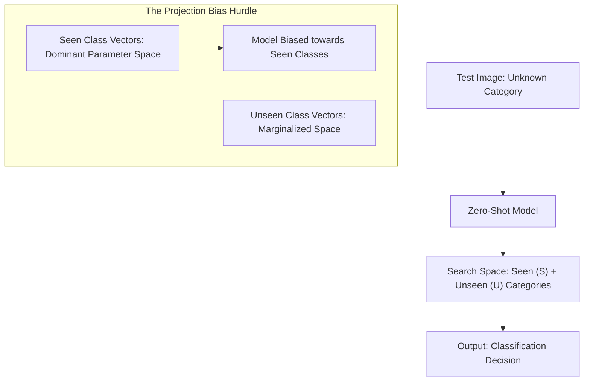

# Generalized Zero-Shot Classification (GZSC)

**Generalized Zero-Shot Classification (GZSC)** (formalized by Chao et al., 2016) is the industry-standard evaluation paradigm for zero-shot systems operating in open-world environments.

## Definition
Unlike the conventional zero-shot setup where the target search space at inference is restricted only to unseen classes, GZSC evaluates the model on a joint search space containing **both** seen ($S$) and unseen ($U$) classes.

$$\mathcal{X} \rightarrow \mathcal{Y}_S \cup \mathcal{Y}_U$$

## The Projection Bias Hurdle
In GZSC, models suffer heavily from **Projection Bias**. Because the network parameters have been optimized on the seen training classes, the model displays a strong mathematical tendency to project test items onto seen class vectors.

### Common Mitigations
1. **Calibrated Decoder (Class Calibration):** Artificially reducing the logits of seen classes by a constant factor during inference to balance the probability distributions.
2. **Generative ZSL:** Using Generative Adversarial Networks (GANs) or Variational Autoencoders (VAEs) to synthesize visual features for unseen classes using their text descriptions. The model can then be trained as a standard supervised classifier.

[← Back to README](../README.md)
