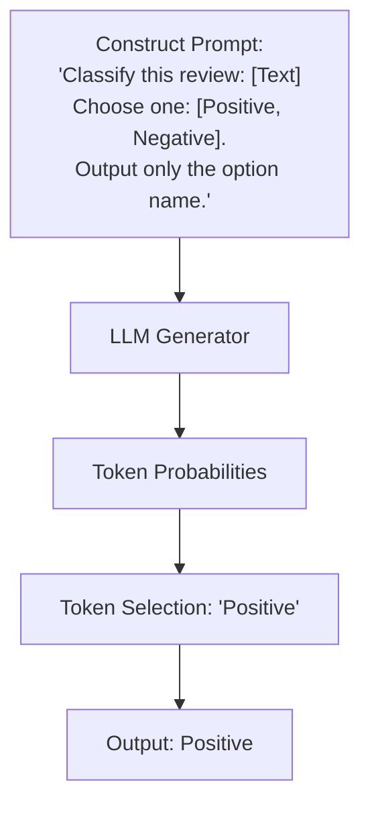

# Generative / Prompt-Based Zero-Shot Classification

**Generative or Prompt-Based Zero-Shot Classification** leverages autoregressive Large Language Models (LLMs) to perform categorization via in-context instruction reading and token generation.

## Overview
Instead of checking internal similarity scores (like Dual-Tower networks) or entailment probability (like NLI models), this paradigm configures the text classifier as a question-answering or completion prompt. The model processes the prompt as an instruction and predicts the next token, which represents the chosen category.

## Prompt Engineering Paradigms
- **Zero-Shot Prompting:** Provide a structural description of the task and class labels, asking the LLM to output the selected category directly without any context examples.
- **Verbalization:** Mapping output class IDs to readable, high-probability language words (e.g., mapping target class `0` to `"terrible"`, `1` to `"excellent"`), which allows the LLM to easily utilize its language generation parameters.

## Challenges
- **Format Consistency:** Autoregressive models can sometimes output conversational filler (e.g., `"The answer is positive"`) rather than the raw label option.
- **Computational Cost:** Running autoregressive generation is computationally heavier than running NLI or dual-tower classification matrices.

[← Back to README](../README.md)
