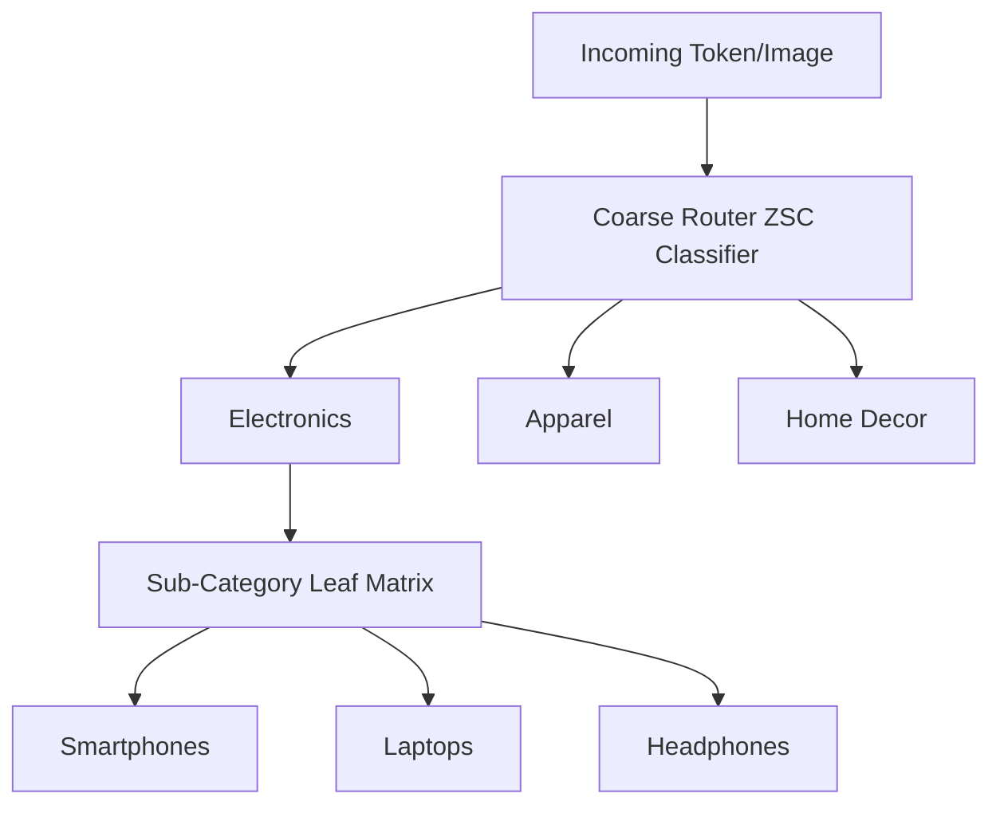

# High Inference Latency and Softmax Saturation

Scaling zero-shot classification to large hierarchies (e.g., categorizing items into 10,000+ retail sub-categories) introduces severe computational and numerical bottlenecks.

## The Problem
1. **Computational Bottleneck:** Dual-tower models or cross-attention text classifiers must calculate alignment logits for *every single candidate label* in the catalog. If there are thousands of classes, running these calculations for every incoming data point results in unacceptable latency.
2. **Softmax Saturation:** As the class list grows, the logit vector expands. Applying a global Softmax over thousands of classes can cause numerical saturation, where probability distributions flatten out or suffer from extreme gradient vanishing.

## Mitigation: Hierarchical Taxonomy Router
To bypass these bottlenecks, zero-shot pipelines deploy a **Hierarchical Taxonomy Router**:
- **Step 1 (Macro Routing):** A fast, lightweight zero-shot pass classifies the item into a coarse top-level category (e.g., `"Electronics"`).
- **Step 2 (Leaf Routing):** The payload is routed to a specialized leaf-node model that evaluates only the sub-categories belonging to that specific macro-group (e.g., evaluating only `"Smartphones"`, `"Laptops"`, and `"Headphones"`), pruning the rest of the search space.
- **Benefits:** Reduces the number of dot-product calculations from $N$ (all classes) to $\log N$ (hierarchical tree search), maintaining sub-millisecond latencies.

[← Back to README](../README.md)
