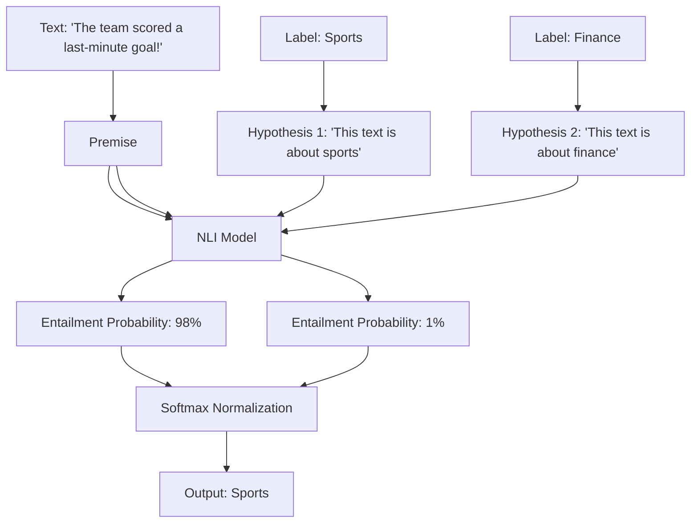

# The Natural Language Inference (NLI) Revolution

The **NLI Revolution** (Yin et al., 2019) represents a major paradigm shift that brought robust, generalized zero-shot classification to Natural Language Processing (NLP).

## Overview
Instead of training custom classification heads for every text categorization task, this approach reformulates classification as a textual entailment task. Under Natural Language Inference (NLI), the model determines if a *Premise* logically entails, contradicts, or is neutral towards a *Hypothesis*.

By framing the input text as the **Premise** and converting target labels into **Hypotheses** (e.g., `"This text is about {label}"`), any pre-trained NLI model can function as a zero-shot classifier out of the box.

## Key Contributions
- **Zero-Shot Flexibility:** Developers can define classification categories at runtime simply by typing the label names as text.
- **Hypothesis Engineering:** The format of the hypothesis template (e.g., `"This is a document about {}"`) can be tuned to improve performance on specific tasks like sentiment analysis, topic detection, or intent routing.

[← Back to README](../README.md)
