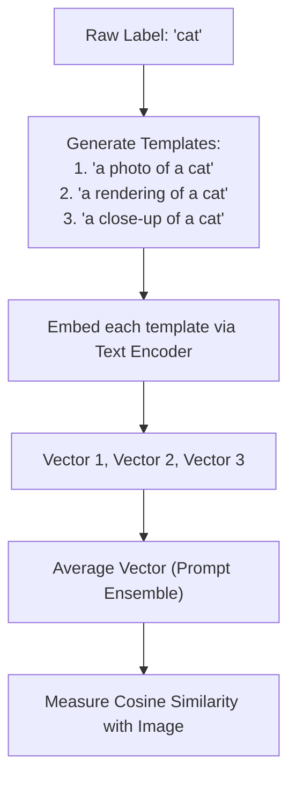

# The Prompt Sensitivity Bottleneck

The **Prompt Sensitivity Bottleneck** represents a major engineering challenge in zero-shot systems where minor, non-semantic changes in a prompt template cause drastic fluctuations in classification accuracy.

## Overview
Because zero-shot classifiers (like CLIP or GPT-based categorizers) interpret labels via text embeddings, their performance depends heavily on the context surrounding the label. A model might fail to recognize `"dog"` but score 95% accuracy when prompted with `"a high-quality photo of a small dog in a sunny backyard"`.

## Mitigation: Ensemble Prompt Averaging
To resolve prompt sensitivity, modern engineering pipelines implement **Ensemble Prompt Averaging**.
- **Process:** Instead of mapping a label to a single prompt, the label is formatted into dozens of distinct templates (e.g., CLIP uses 80 templates for ImageNet).
- **Pooling:** The text encoder generates embedding vectors for all templates. These vectors are averaged to construct a single, robust representation for the target class. This significantly smooths out the sensitivity to phrasing.

[← Back to README](../README.md)
